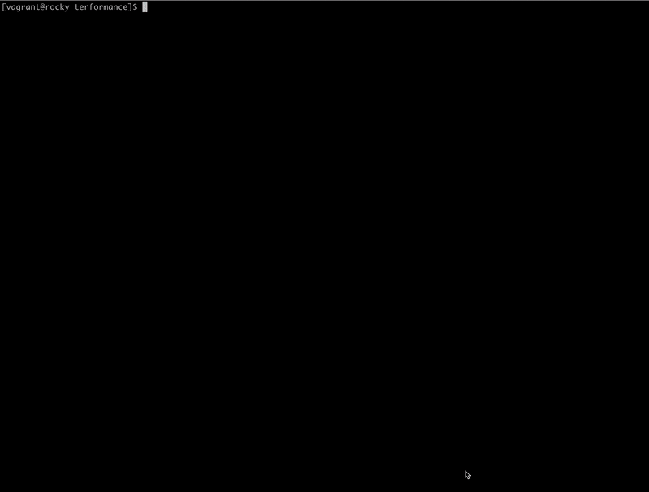

# Terminal performance

Program used in the background of a University's commemoration.


## Usage

A file with the following format is required as argument:

```yaml
content:
  - text: "Hello"
    color: white
  - text: "Goodbye"
    color: yellow
```

### Execution

```
go run main.go <your_file.txt>
```

### Hot keys

- Ctrl + A: Update number of people
- Ctrl + B: Update university age
- Ctrl + D: Update number of lights
- Ctrl + E: Display new file message

## Example


